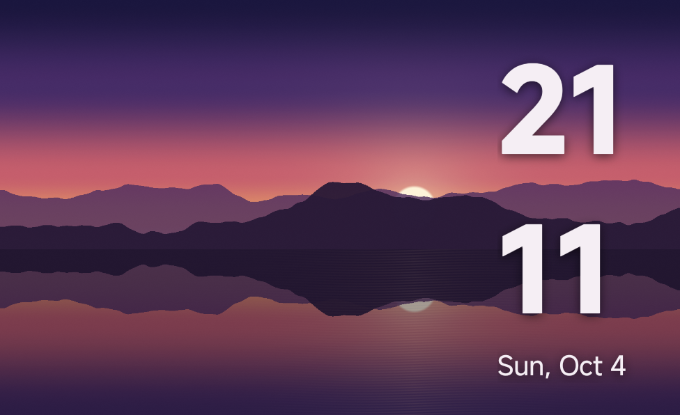
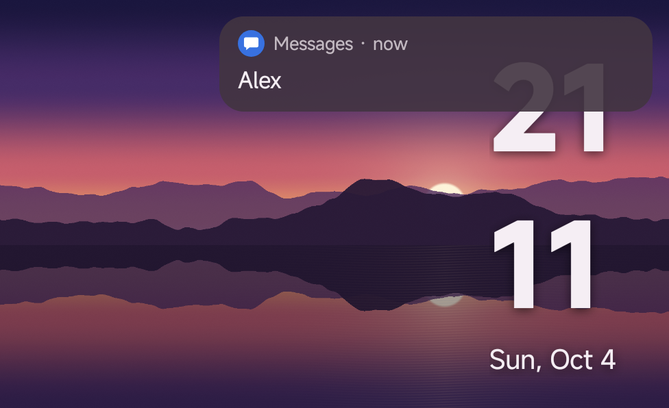
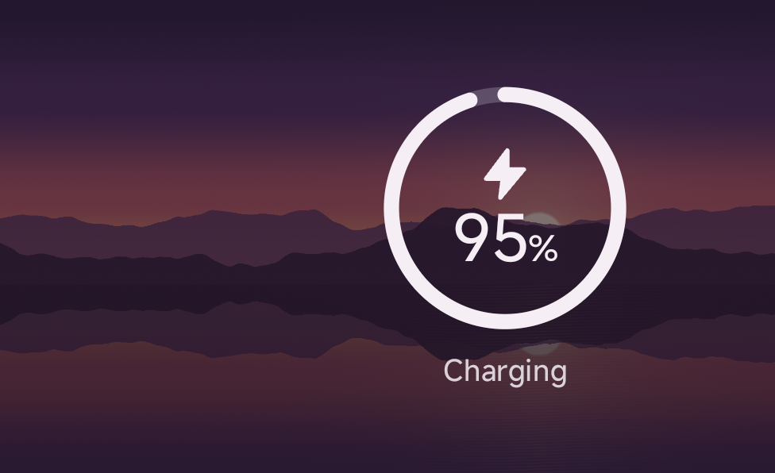
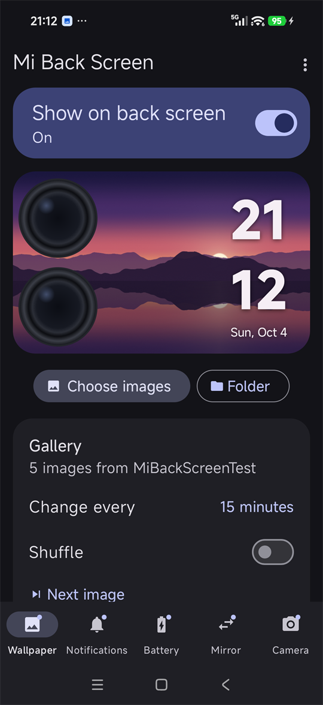
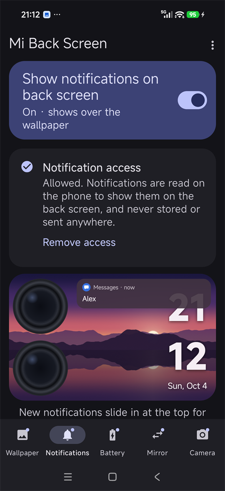
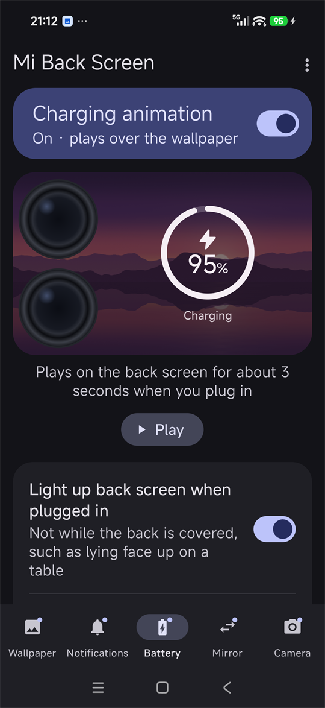
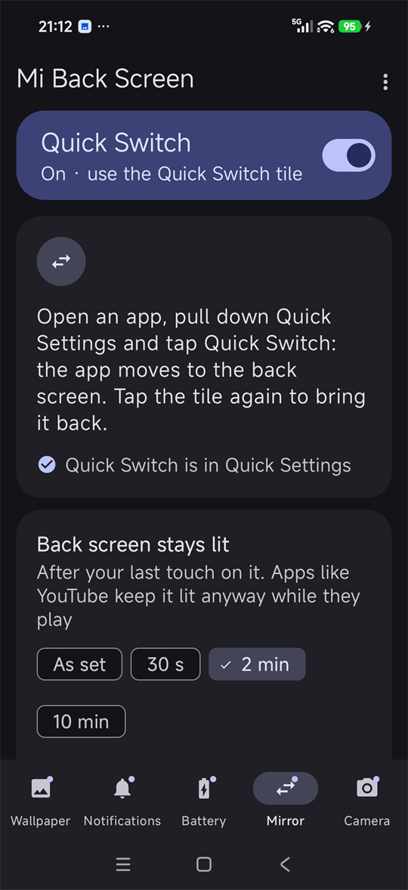
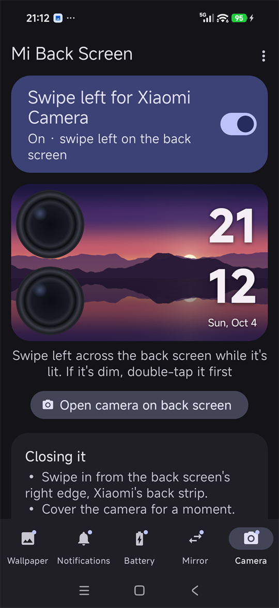

# Mi Back Screen

Show your own images, animated GIFs, a clock and your notifications on the **Xiaomi 17 Pro Max** rear display, move the app you're using there with one tap, and swipe left on it for Xiaomi Camera.

**Website:** https://totallynotkasai.github.io/mi-back-screen/
**Download:** [latest APK](https://github.com/totallynotkasai/mi-back-screen/releases/latest/download/MiBackScreen.apk)

<p align="center">
  
  
  
</p>
<p align="center">
  
  
  
  
  
</p>

## Features

The app has five sections, one per tab, each with its own switch. The **?** at the top of each tab explains it.

### Wallpaper

- Images and looping GIFs, chosen with the system photo picker
- Gallery: pick several images or a folder and it changes image every 1 minute to 1 day, in order or shuffled
- Works with no images too: the back screen is black, with the clock if it's on. **Remove images** clears the app's copies or lets go of the folder
- Scaling: Fill, Fit, Stretch or None (actual size, centred)
- Panning: images that don't fit the screen's shape glide slowly up and down or side to side, at Slow, Medium or Fast. It only moves while the back screen is lit
- **Skip short pans:** an image that would barely move (less than 15%, 25% or 40% of the screen, your choice) stays still in the middle instead; the next one pans as usual
- Optional clock (time and date) over the wallpaper, in five styles: drag it anywhere in the preview or align it to an edge; any text colour, or Auto to stand out from the image; optional background colour and opacity
- The clock stays on time while the phone sleeps, including on the dimmed back screen
- Preview shaped like the rear display, with an option to keep the image clear of the camera
- **Back screen display:**
  - **Stays lit for** sets how long the back screen stays bright after a touch or a wake, from 5 seconds to 5 minutes, or **As set** for Xiaomi's own time. It's Xiaomi's setting, so it counts with the wallpaper off too
  - **Stay fully lit while unlocked** keeps it bright while you use the phone, and lets it dim once you lock it
  - **Light up when you pick it up** lights it again if it went black while the phone lay on its back
- Quick Settings tile and home-screen widget to turn it on and off, and schedules to do it at set times (e.g. off overnight), as many as you like
- It stays on the back screen by itself, and comes back after the phone restarts as soon as Shizuku is running again. **Refresh back screen**, in the menu, puts it up afresh if something didn't update

### Notifications

- A new notification slides in at the top of the back screen for a few seconds, showing as much as you choose: just the app (Discreet), who it's from (Normal) or the message too (Full)
- Pull down from the top of the back screen for the ones you haven't cleared
- While the phone is locked it follows your lock screen, so sensitive content stays hidden if that's how your lock screen is set
- With the wallpaper off, Xiaomi's own back screen shows notifications instead

### Battery

- When you plug in, the back screen lights up and plays a short animation with the battery level (wired or wireless), then fades back to the wallpaper
- Three styles: **Ring** (the level fills a ring, with the number in the middle), **Edge glow** (a glow runs round the edge as far as the level, then stays faint for as long as it charges) and **Minimal** (a small bolt and the level by the clock)
- In a colour taken from the image on the back screen (**Auto**), or any colour you pick
- It stays dark while the back is covered, and can also play over Xiaomi's back screen while the wallpaper is off

### Mirror

- **Quick Switch**, a Quick Settings tile, moves the app you're using to the back screen. Bring it back with another tap, from its notification, or by covering the back if you turn that on
- The back screen stays lit for as long as you choose after your last touch (2 minutes by default; **As set** follows **Stays lit for** on the Wallpaper tab), and apps can show smaller or in portrait there. Xiaomi's settings are put back when the app leaves

### Camera

- Swipe left on the wallpaper (from anywhere, the right edge included) and Xiaomi Camera opens on the back screen in its own back-screen mode, on the main cameras, locked or unlocked
- Close it with Xiaomi's back strip, by covering the camera for a moment, or from its notification; it also closes when the back screen dims
- **Open camera on back screen** on the Camera tab opens it without a swipe, with the wallpaper off too

No internet permission, no storage permission.

## Requirements

- Xiaomi 17 Pro Max on HyperOS (Android 13+)
- [Shizuku](https://shizuku.rikka.app/), running and authorised for Mi Back Screen

## Setup

1. Install and start Shizuku (wireless debugging or ADB).
2. Install the APK and open Mi Back Screen.
3. Tap **Allow access** (or enable it in Shizuku → Authorized apps).
4. Pick images (or a folder) and turn on **Show on back screen**.
5. For schedules and the clock: if the app shows **Setup needed**, allow alarms, and in Settings → Apps → Mi Back Screen turn on **Autostart** and set **Battery saver** to **No restrictions**.
6. For notifications: turn on **Show notifications on back screen** on the Notifications tab. Shizuku allows Notification access in the same tap. Without Shizuku, allow it in Settings; Android blocks that for sideloaded apps until you open App info → ⋮ → **Allow restricted settings**.
7. For Quick Switch: turn on **Quick Switch** on the Mirror tab (allow notifications when asked, for the one that brings the app back), and tap **Add Quick Switch to Quick Settings**.
8. For the camera: turn on **Swipe left for Xiaomi Camera** on the Camera tab. It works on the Mi Back Screen wallpaper, so turn that on too. A dimmed back screen takes no touches: double-tap it first, then swipe left.

## Good to know

- **A dimmed back screen takes no touches.** Double-tap it to light it, then swipe.
- **On a table:** lying on its back, the back screen switches off. Once it has been dim for 90 seconds, or 5 minutes in the dark, Xiaomi leaves it off when you pick the phone up. **Light up when you pick it up** (on by default) lights it again, while the phone is unlocked.
- **Before uninstalling,** set **Stays lit for** to **As set**. It changes Xiaomi's own setting, which stays as you chose it once the app is gone.
- **The "Mi Back Screen is on" notification:** Android requires one while the app works in the background. Swiped away, it stays away until it has something new to say, and **Hide** on it (or in **Setup help**) opens the switch to turn it off for good. The app carries on as before.
- **Quick Switch from a video playing sideways:** with the main screen on and sideways, the back screen lights once you turn the phone over or press Power. Touching it before then brings up Xiaomi's "Press the Power button" message.
- **Apps on the back screen:** a video playing full screen may start again from the app's home page; the keyboard may open on the main screen; some video apps show black on a second screen; and the main screen stays as it was, turning off as usual.
- **Xiaomi Camera** shows its own page on the main screen while it's up, and turns the main screen off after about 30 seconds. It closes by itself when the back screen isn't touched for a while, even while recording, so tap it now and then during a long video.
- **After a restart** Shizuku has to be started again (unless your phone is rooted). Mi Back Screen waits for it, then carries on.

## Building

Requires JDK 17 and the Android SDK.

```bash
./gradlew assembleDebug
```

The APK is written to `app/build/outputs/apk/debug/`. Unit tests run with `./gradlew testDebugUnitTest`.

## How it works

HyperOS doesn't let normal apps draw on the rear display, so Mi Back Screen uses Shizuku to run a fixed set of `am`, `input` and `cmd` commands (see [`RearCommands.kt`](app/src/main/java/com/backscreen/wallpaper/core/RearCommands.kt)):

- **Putting the wallpaper up.** It's launched straight onto the rear display while the phone is unlocked. While it's locked, HyperOS only allows its own apps there, so the wallpaper is opened on the main display and its task moved to the rear.
- **Keeping it there.** Each time the rear dims, Xiaomi's back screen app brings its own launcher back and closes whatever was on top, but only if that launcher has been opened since Xiaomi's app started. So when the wallpaper goes up over Xiaomi's launcher, Xiaomi's app is restarted **once**; it comes straight back without the launcher and leaves the wallpaper alone. If anything closes the wallpaper anyway, it's put back. (Up to 1.3 the app stopped Xiaomi's app every time, which relit the rear about every 10 seconds.)
- **Switching off** brings Xiaomi's launcher back.
- **Charging.** The animation is drawn inside the wallpaper window that's already on the back screen, so it appears at once. With the wallpaper off, that window goes up over Xiaomi's screen just for the animation (only if you allow it). The back screen is only lit for it when it's dark, the back isn't covered, and the main screen isn't turned sideways: HyperOS treats a back-screen wake then as an accident and covers it with its own "Press the Power button" screen. The edge glow follows the back screen's own rounded corners, and is drawn once into a blurred image, so the faint glow that stays while charging is never redrawn. **Auto** picks its colour from the image on the phone, with AndroidX Palette.
- **Back screen display.** **Stays lit for** writes Xiaomi's own timeout (`settings put system subscreen_display_time`), saving Xiaomi's value first and putting it back for **As set**; while an app is on the back screen with Quick Switch, a new value waits until it leaves. **Stay fully lit while unlocked** keeps the wallpaper window's screen on while the phone is unlocked and the main screen is on, and lights the back screen at unlock, since Xiaomi dims it at the lock. **Light up when you pick it up** reads the back sensor only while the back screen is off and you're using the phone, and lights it when the back goes from covered to clear.
- **Notifications.** A notification listener (Notification access, which Shizuku grants with `cmd notification allow_listener`) passes new notifications to the wallpaper window, which shows them as a banner at once. It skips ongoing ones, media players, downloads in progress, group summaries, silent ones, anything Do Not Disturb holds back, and the app you're using. The back screen is lit for a new one at most once a minute per app, not while you're using the phone or the back is covered; on a dimmed back screen the banner just appears, without lighting it.
- **Quick Switch.** The tile finds the app in front on the main screen (`am stack list`) and moves its task to the back screen (`am display move-stack`). While it's there, the app raises Xiaomi's own back-screen timeout (`settings put system subscreen_display_time`), and the back screen's density and rotation if you chose a smaller size or portrait (`wm density`, `wm user-rotation`), saving each value first and putting it back when the app leaves, after a crash or a restart too, and only if you haven't changed it yourself meanwhile. With the wallpaper off, Xiaomi's app is restarted once, as above, so it doesn't take the back screen back. A check every 3 seconds notices when the app is closed or leaves. The back screen is lit for the app once the main screen is upright or off, to keep clear of HyperOS's "Press the Power button" screen.
- **The camera.** A swipe left on the wallpaper opens Xiaomi Camera on the back screen with the same command Xiaomi's own back screen uses (`am start --display 1 -n com.android.camera/.Camera` with its launch flags), or with the standard camera intent if that ever fails. Xiaomi Camera is allowed there while locked, lights the back screen itself, and shows its own page on the main screen. Mi Back Screen then leaves the back screen to it, and closes it with BACK (as Xiaomi's back strip does) when you cover the camera, tap **Close camera**, or the back screen dims; a dimmed back screen takes no keys, so there it's stopped after a second instead. Xiaomi Camera also closes by itself after a while unused.
- **The clock.** A dimmed back screen keeps showing its last frame, and the phone sleeps between minutes. So while the clock is on the back screen and that screen is lit or dimmed, an exact alarm wakes the phone briefly at each minute, the new time is drawn, and a short draw wake lock sends the frame to the dimmed panel, as the system's own always-on displays do. While the back screen is off (for example when the back is covered), there's no alarm; the clock catches up as soon as it wakes.

## Battery

Measured on a 17 Pro Max (HyperOS 3.0.319), unplugged and locked for an hour with the clock showing on the dimmed back screen almost the whole time: the app used an estimated **1.5 mAh**, about 0.02% of the battery. That's 46 one-minute wake-ups of about a second each, and the battery level didn't drop a percent. Every clock update arrived within 1.5 seconds of the minute.

Panning only moves while the back screen is lit; a dimmed back screen shows its last frame and costs nothing extra. Measured with the back screen held lit (three 5-minute runs each way, extrapolated): panning at Medium cost the app about **20 mAh per lit hour**, 0.3% of the battery, against about 1 mAh with it still. That's about 5 mAh a day if the back screen is lit for 15 minutes in all.

The charging animation runs for 3.5 seconds once per plug-in, using under a second of processor time; lighting the back screen for it keeps it lit for about 16 seconds. The edge glow's faint part while charging is a still image, so it costs nothing to keep up.

**Stays lit for** and **Stay fully lit while unlocked** keep the back screen lit for longer, and panning moving all that time: about 20 mAh an hour for panning, plus the back screen itself.

## Privacy

No internet permission and no storage permission. Only the images or folder you pick are shared with the app; chosen images are copied into the app's private storage, and **Remove images** deletes those copies. Nothing leaves the phone.

Notifications are read only once you allow Notification access, and only while the Notifications section is on. Their text is read on the phone, shown on the back screen, kept in memory only while the notification is in your shade, and never stored or sent anywhere. **Remove access** on the Notifications tab takes the access away again.

Quick Switch reads the names of apps that have a launcher icon, to say which one is on the back screen. It can't see anything else about them.

There's no camera permission: Xiaomi Camera takes the photos and saves them to Gallery, as it always does. Mi Back Screen only opens and closes it.

Not affiliated with Xiaomi.
